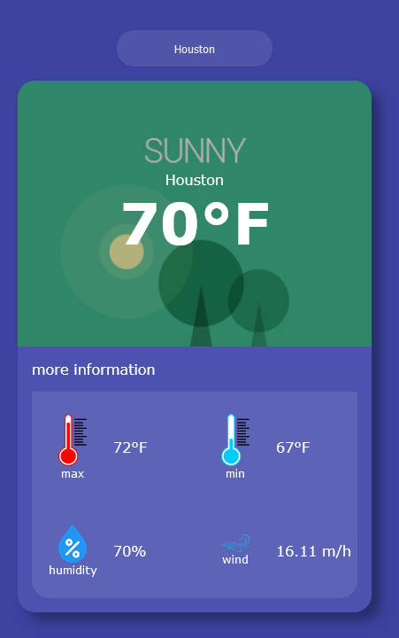
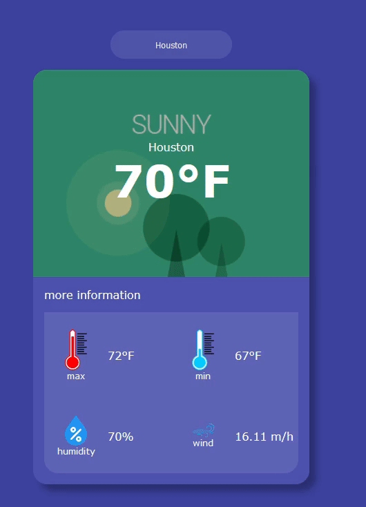

# Angular Weather
Angular Weather is a simple weather application built with Angular and powered by the Open Weather API from RapidAPI.com.

## Features
- **Real-time Weather Data**: Fetches real-time weather data from the Open Weather API to provide accurate and up-to-date information.
- **Temperature Display**: Displays current temperature, maximum temperature, and minimum temperature for the selected city.
- **Humidity**: Shows the humidity level of the selected city's weather.
- **Wind Speed**: Provides information about the wind speed in the selected city.
- **Search Functionality**: Allows users to search for weather information by entering the name of the city they want to know about.

## Try It Out

You can experience the AngularWeatherApp by visiting [this link](https://mespino4.github.io/Angular-Weather-App/).

## How to Use

1. Simply type the name of the city you want to check the weather for in the search box.
2. Hit Enter or click on the search button.
3. Instantly view the temperature, maximum temperature, minimum temperature, humidity, and wind speed for the selected city.

## Technologies Used

- **Angular**: Angular framework is used for building the frontend of the application.
- **Open Weather API**: Utilizes the Open Weather API from RapidAPI.com to fetch weather data.
- **HTML/CSS**: Basic HTML and CSS are used for styling and structuring the application.

## Development Setup

1. Clone the repository.
2. Navigate to the project directory.
3. Install dependencies by running `npm install`.
4. Start the development server with `ng serve`.
5. Visit `http://localhost:4200` in your browser to view the application.

## Screenshots & Demo

## Contribution

Contributions are welcome! Feel free to submit issues, feature requests, or pull requests.

## License

This project is licensed under the [MIT License](LICENSE).

